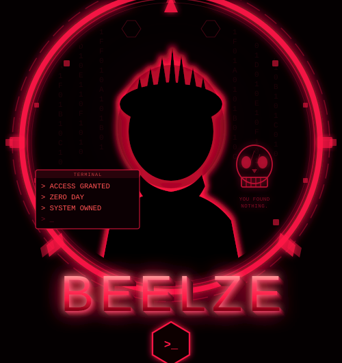

<div align="center">




<br/>

[](https://github.com/1beelze)
&nbsp;

&nbsp;

&nbsp;


</div>

---

## `[ ABOUT ]`

```
> whoami
  ╔══════════════════════════════════════════════════╗
  ║  HANDLE  : BEELZE                               ║
  ║  ROLE    : Red Teamer / Bug Bounty Hunter       ║
  ║  FOCUS   : WordPress CVE · PHP Exploits         ║
  ║  PLATFORM: Bugcrowd · HackerOne · VDP           ║
  ║  LAB     : Windows 11 Pro + Docker              ║
  ╚══════════════════════════════════════════════════╝
```

---

## `[ ARSENAL ]`

<table>
<tr>
<td valign="top" width="33%">

**⚔️ Offensive**
```
Burp Suite Pro
sqlmap
nuclei
ffuf / feroxbuster
wpscan
metasploit
```

</td>
<td valign="top" width="33%">

**🎯 Vuln Classes**
```
File Upload → RCE
Privilege Escalation
SQL Injection
Auth Bypass
IDOR / SSRF
0day Research
```

</td>
<td valign="top" width="33%">

**🖥️ Environment**
```
Python 3.x
Bash / PowerShell
Docker
Kali Linux
Windows 11 Pro
```

</td>
</tr>
</table>

---

## `[ GITHUB STATS ]`

<div align="center">


&nbsp;


<br/><br/>


<br/><br/>


</div>

---

## `[ CVE HALL OF FAME ]`

| CVE ID | Target | CVSS | Impact | Status |
|--------|--------|:----:|--------|:------:|
| CVE-2026-63030 | WordPress Core 6.9.0–7.0.1 | `9.8` | Pre-Auth RCE (Route Confusion + SQLi Chain) | ✅ |
| CVE-2026-15282 | Instant Appointment ≤1.2 | `9.8` | Unauth File Upload → RCE | ✅ |
| CVE-2026-14894 | Super Forms ≤6.3.313 | `9.8` | Unauth File Upload → RCE | ✅ |
| CVE-2026-48908 | SP Page Builder ≤6.6.1 (Joomla) | `10.0` | Unauth File Upload → RCE (ZIP Extract) | 🔄 |
| CVE-2026-9067 | Schema & Structured Data WP ≤1.59 | `9.1` | Unauth File Upload (GIF89a Polyglot) | ✅ |
| CVE-2025-7340 | HT Contact Form Widget ≤2.2.1 | `9.8` | Unauth File Upload → RCE | ✅ |

---

## `[ CONNECT ]`

<div align="center">

[](https://t.me/beelzehere)
&nbsp;
[](https://github.com/1beelze)

</div>

---


